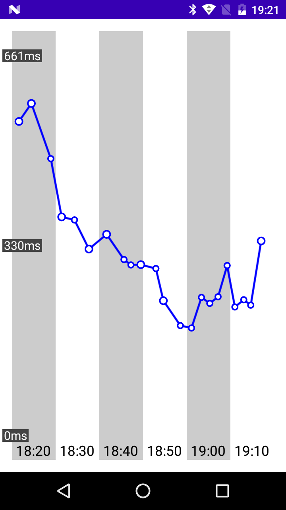

# TimeLineChart



## Usage:

Using [jitpack.io](https://jitpack.io/#99cardz/TimeLineChart)
```Gradle
implementation 'com.github.99cardz:TimeLineChart:0.1.0'
```
Place into your layout xml
```xml
<de.schulzejonathan.timelinechart.TimeLineChart
        android:id="@+id/time_line_chart"
        android:layout_width="match_parent"
        android:layout_height="match_parent"/>
```
Apply style and data changes during the lifetime of your Activity like this:
```kotlin
val chart: TimeLineChart = findViewById(R.id.time_line_chart)
chart.apply {
  data = getSomeData()
  paddingTop = 10f
  linepathPaint.color = Color.BLACK
  
  invalidate()
}
  ```
