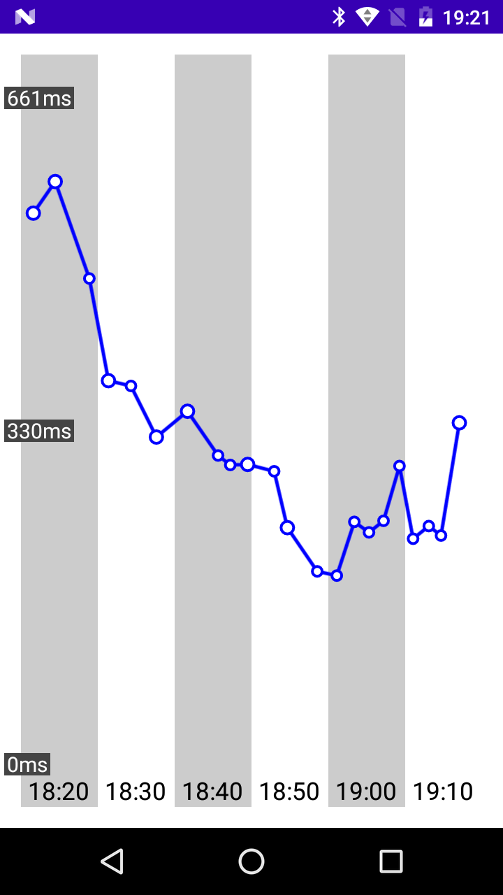

# TimeLineChart

[link to file](https://github.com/99cardz/TimeLineChart/blob/a61a7c3ca8a554e78ddf3140673cbcb63c6805de/src/main/java/de/schulzejonathan/timelinechart/TimeLineChart.kt)


## Example Usage

**onCreate()**
```kotlin
val chart: TimeLineChart = findViewById(R.id.time_line_chart)
chart.apply {

  paddingTop = 50f
  averagePointsEnabled = false
  valueMarkerFormatter = { "${it} foo" }

  invalidate()
}
```
**update Data**
```kotlin
chart.apply {
  data = newData
  invalidate()
}
```

## Data
```kotlin
var data: MutableList<TimeChartEntry>? = null
```
**example**
```kotlin
viewModel.getSomeObservableData().observe(viewLifecycleOwner, { list ->
  chart.apply {
    data = list.map { TimeChartEntry(time = it.timestamp, value = it.someValue) }
    invalidate()
  }
})
```

## Style modifiers

### Padding
```kotlin
var paddingTop = 30f
var paddingBottom = 30f
var paddingLeft = 30f
var paddingRight = 30f

var paddingPathTop = 20f
var paddingPathBottom = 40f
```
### y and x axis
```kotlin
var maxValue: Long? = null
var minValue: Long? = null
var timeStart: Long? = null
var timeStop: Long? = null
```
If not defined, the max and min values will be the max and min of the data.

Similary, start and stop will be the earliest and last timestamp of the data.

### path averaging
```kotlin
var averagePointsEnabled = true
```
This will draw an averaged Point if two or more enties are too close to each other.
### value Marker
```kotlin
var valueMarkerFormatter: (l: Long) -> String = { "${it}" }
```

### Paint
```kotlin
val backgroundPaint = Paint()
val textPaint = Paint()
val legendTextPaint = Paint()
val linepathPaint = Paint()
val circlePaint = Paint()
val circleInsetPaint = Paint()
val yTextBackgroundPaint = Paint()
```
Modify paint like this:
```kotlin
chart.apply {
  textPaint.color = Color.BLACK
  linepathPaint.strokeWidth = 8f
}
```
